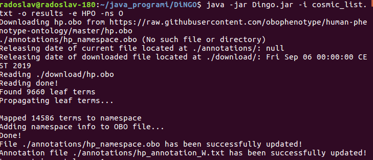
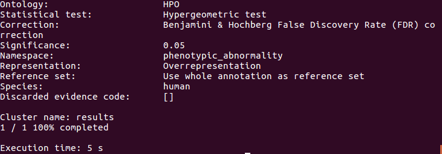
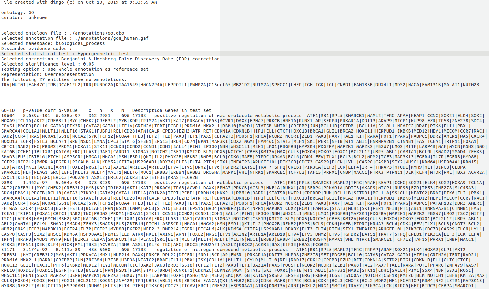
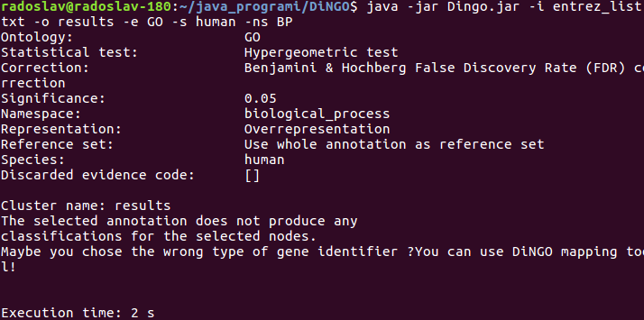
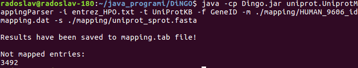
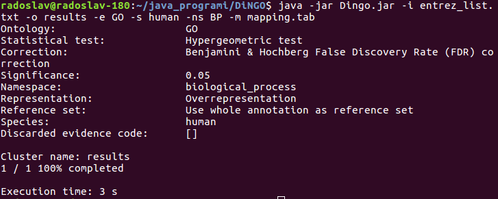

# DiNGO Manual

## Table of Contents
## [1. Introduction](#1-introduction-1)
## [2. Installation](#2-installation-1)
## [3. Requirements](#3-requirements-1)
## [4. Usage](#4-usage-1)
   - ## [4.1. First run](#41-first-run-1)
   - ## [4.2. Command line options](#42-command-line-options-1)
   - ## [4.3. Batch mode](#43-batch-mode-1)
   - ## [4.4. Supported species](#44-supported-species-1)
## [5. Modules](#5-modules-1)
   - ## [5.1. Update module](#51-update-module-1)
        - ## [5.1.1. GO files](#511-go-files-1)
        - ## [5.1.2. HPO files](#512-hpo-files-1)
        - ## [5.1.3. Uniprot mapping files](#513-uniprot-mapping-files-1)
        - ## [5.1.4. SwissProt file](#514-swissprot-file-1)
        - ## [5.1.5. HUGO file](#515-hugo-file-1)
        - ## [5.1.6. Usage](#516-usage-1)
   - ## [5.2. Mapping module](#52-mapping-module-1)
        - ## [5.2.1. Usage](#521-usage-1)
   - ## [5.3. Propagation module](#53-propagation-module-1)
## [6. Usage examples](#6-usage-examples-1)
   - ## [6.1 Enrichment analysis with default ontology and annotation files](#61-enrichment-analysis-with-default-ontology-and-annotation-files-1)
   - ## [6.2 Enrichment analysis with user defined ontology and annotation files](#62-enrichment-analysis-with-user-defined-ontology-and-annotation-files-1)
   - ## [6.3 Use of mapping files](#63-use-of-mapping-files-1)
## [7. Dependencies](#7-dependencies-1)
## [8. News](#8-news-1)
## [9. References](#9-references-1)

## 1. Introduction
DiNGO is a standalone application based on an open source code from BiNGO [1], a Java based tool aimed at determining which Gene Ontology (GO) categories are overrepresented in a set of genes. DiNGO is a command line application which is able to perform GO and HPO term enrichment on a set of genes or proteins. Also, there are additional modules that bring new functionalities to DiNGO.
## 2. Installation
Download [DiNGO.zip](https://www.vin.bg.ac.rs/180/tools/DiNGO.php) file and extract contents. There should be a DiNGO.jar file and folder configuration containing the conf.properties file. The file defines the parameters necessary for program execution.
## 3. Requirements
Java Runtime Environment (JRE) 1.8

## 4. Usage

To run DiNGO open the terminal (Command prompt in Windows) in the folder where the jar file is located and type the following:

`java -jar Dingo.jar -h`

If everything is ok the help text should appear.

### 4.1. First run

When DiNGO is run for the first time it will create three folders: annotations, download and mapping. The first folder should contain default ontology and annotation files. The files can be downloaded and updated by using the update module (see [the Update module](#51-update-module-1) section). The downloaded files are temporally placed in the download folder. The third folder, mapping, is located where DiNGO downloads the UniProt, HUGO and SwissProt files (see the Update Module section).

### 4.2. Command line options

There are several options that should be defined in order to perform the enrichment analysis. The -o option defines the name of the output file that contains the results. The -i option defines the name of the file containing a list of gene/proteins (one gene/protein per line). It is mandatory to define the namespace (subontology) for which the enrichment analysis will be run. For example -ns BP means that only terms belonging to the biological process subontology will be taken into consideration. In order to specify the species, it is necessary to use the -s option. Basically, it is possible to run the GO enrichment analysis by typing the following:

`java -jar Dingo.jar -o results -i list_of_genes -ns BP -s Homo_sapiens`

If HPO term enrichment analysis is needed then the usage of the option -e is required

`java -jar DiNGO.jar -o results -i list_of_genes -ns O -s Homo_sapiens -e HPO`

Note that in the above case using -s is optional.

Under the default settings DiNGO uses the Hypergeometric test, but the user may switch to the Binomial test by using the -st option. The following example uses the Binomial test:

`java -jar Dingo.jar -o results -i list_of_genes -ns BP -s Homo_sapiens -st 2`

If not specified DiNGO uses the whole annotation as a reference set. This can be changed by passing the name of the file containing the reference set (-rs option).

The user can specify the ontology and annotation files by using the -of and -af options, respectively. DiNGO supports the OBO format for ontology and annotation files in the GAF format. Additionally, DiNGO may use custom ontology and annotation files created by the user. By default, DiNGO uses the default ontology and annotation files. In case these files are not in the annotations folder, DiNGO will try to download them first and then to do the enrichment analysis.

It is possible to exclude some annotation entries from the analysis by defining the evidence codes that will not be taken into consideration. The following example does not use the Electronic Annotation (IEA) and Traceable Author Statement (TAS) evidence codes:

`java -jar Dingo.jar -o results -i list_of_genes.txt -ns BP -s human -dc IEA:TAS`

Note that the codes are separated by a colon. A detailed description of the evidence codes can be found at [http://geneontology.org/docs/guide-go-evidence-codes/](http://geneontology.org/docs/guide-go-evidence-codes/). 

A common issue while doing enrichment analysis is the use of unsupported gene/protein identifications (IDs). DiNGO supports an ID only if the ID is contained in the annotation file. To overcome this issue, the user can specify the TAB delimited file which contains in one column the supported IDs and in other columns appropriate unsupported IDs (-m option). 

### 4.3. Batch mode

The DiNGO batch mode works the same as the [BiNGO](https://www.psb.ugent.be/cbd/papers/BiNGO/User_Guide.html) batch mode. Firstly, clusters in the input file are separated by the keyword batch. Secondly, when defining the -o option it is necessary to use a `batch`. Note that each cluster starts with a cluster name. The following example runs DiNGO in batch mode:

`java -jar Dingo.jar -o batch -i input_file -ns BP -s human`

It is important to say that DiNGO is a multi-threaded application. So, when the batch mode is used, it is possible to speed up the processing time by defining the number of threads. It can be done by using option -t.

`java -jar Dingo.jar -o batch -i input_file -ns BP -s human -t 4`

### 4.4. Supported species

DiNGO supports GO enrichment analysis for 22 species. The list of supported species can be found in the configuration file ([conf.properties](configuration/conf.properties)). Note that some species have an alias. For instance, GO enrichment analysis on a set of human gene/proteins could be invoked as follows:

`java -jar Dingo.jar -o results -i list_of_genes.txt -ns MF -s Homo_sapiens`

or 

`java -jar Dingo.jar -o results -i list_of_genes.txt -ns MF -s human`

Similarly, it is possible to use the -s mouse instead of the -s Mus_musculus or -s dog instead of -s Canis_domesticus.

## 5. Modules

DiNGO’s functionality is extended by three modules: update, mapping and propagation module. Each of them could be used as a separate application.

### 5.1. Update module

The update module performs the download and processing of GO and HPO annotation resources upon user request. This functionality enables the user to do enrichment analysis based on up-to-date ontology and annotation files. In addition, the module offers an option for downloading UniProt [2] (ftp://ftp.uniprot.org/pub/databases/uniprot/current_release/knowledgebase/idmapping/by_organism/) and [HUGO Gene Nomenclature Committee (HGNC)](https://www.genenames.org/) [3] mapping files as well as the SwissProt uniprot_sprot.dat file.

#### 5.1.1. GO files

The module downloads GO OBO and annotation files in the [GAF format](http://geneontology.org/docs/go-annotation-file-gaf-format-2.1/). In case that the GO files in the DiNGO annotation folder have an older date than the downloaded ones they will be replaced.

#### 5.1.2. HPO files

The module downloads the HPO OBO file and two annotation files: phenotype.hpoa and genes_to_phenotype.txt (https://hpo.jax.org/app/download/annotation). In order to be used by DiNGO the files have to be processed. The HPO OBO file has no information about the term namespace (subontology) that is used by the DiNGO OBO file parser. Given that, after downloading the HPO OBO file will be updated with namespace information for each term (see [the Propagation module](#53-propagation-module-1)).On the other hand, information contained in the downloaded annotation files will be used for creation of the DiNGO compatible file. The new annotation file contains the gene and the associated HPO term in each line.

#### 5.1.3. Uniprot mapping files

The module downloads the UniProt mapping file which can be used by the mapping module. Detailed explanation of the file structure can be found at the following link ftp://ftp.uniprot.org/pub/databases/uniprot/current_release/knowledgebase/idmapping/README. The file is downloaded into the mapping folder. 

#### 5.1.4. SwissProt file

The module downloads the uniprot_sprot.dat file, containing the annotated curated entries, which can be used by the mapping module. The file has a multi FASTA format. 

#### 5.1.5. HUGO file

The update module uses an HGNC REST web service to download all records with an approved symbol (https://www.genenames.org/help/rest/). The module downloads the XML HUGO file and extracts information from it. As a result a TAB delimited file is created which contains HGNC, Uniprot identifiers as well as gene symbols in each line. The file can be used by DiNGO.

#### 5.1.6. Usage

The application has three options. The option -f defines the file type that should be downloaded (GO, HPO, HUGO, UniProt, SwissProt) and this option is mandatory. The -sp option defines the species (GO and UniProt files) or namespace (HPO file). If not specified it will be assumed that the species is human (GO, UniProt) or that all HPO namespaces should be taken into consideration. The third option, -d, is used only with HPO and GO files. The option specifies which files will be updated: the ontology file (-d 1), annotation file (-d 2) or both files (-d 3). The example below shows how to download and update the GO ontology and annotation file:

`java -cp Dingo.jar update.DiNGOFilesUpdater update -f GO -sp Mus_musculus -d 3`

### 5.2. Mapping module

The mapping module converts one set of identifiers (IDs) into another one. The tool is inspired by [UniProt mapping tool](https://www.uniprot.org/uploadlists/). The mapping module relies on Uniprot idmapping.dat and SwissProt uniprot_sprot.fasta files (see [the Update Module](#51-update-module-1) section). As an input the module accepts the list of IDs (one ID per line). The output file contains input IDs in the first column and required IDs in the second one. Note that like the UniProt mapping tool, the module requires input IDs or output ones to be UniProt identifiers. In other words, it is possible to convert gene symbols to UniProt IDs, but it is not possible to convert gene symbols to Ensembl gene IDs. The module can be run as a standalone application.

#### 5.2.1. Usage

The following example will convert gene symbols identifiers into UniProt ones taking into consideration only manually curated entries:

`java -cp DiNGO.jar uniprot.UniprotMappingParser -i input_file -t UniProtKB -f Gene_Name -m HUMAN_9606_idmapping.dat -s uniprot_sprot.fasta`

As a result a file mapping.tab will be created. The file contains two columns separated by TAB. The first column contains gene symbol IDs and the second contains UniProt IDs.

Help is invoked in the following way:

`java -cp DiNGO.jar uniprot.UniprotMappingParser`

### 5.3. Propagation module

The propagation module’s function is to add namespace information to each term in the HPO OBO file. It can be invoked in the following way:

`java -cp Dingo.jar propagation.Propagation -i <input HPO obo file> -o <output OBO file>`

## 6. Usage examples
Setting up DiNGO for enrichment analysis is straightforward. The following examples demonstrate common usage scenarios.

### 6.1. Enrichment analysis with default ontology and annotation files

The following example demonstrates how to do enrichment analysis of HPO terms on the gene set contained in [cosmic_list.txt](datasets/cosmic_list.txt). The file contains 723 genes represented by their gene symbols.
In order to do enrichment analysis the user has to specify the input file (cosmic_list.txt), the output file which will contain results of the analysis, ontology (HPO) and namespace (subontology, in this case phenotypic abnormality). Taking into consideration all of the aforementioned, DiNGO is invoked in the following manner:

`java -jar Dingo.jar -i cosmic_list.txt -o results -e HPO -ns O`

Given that the ontology and annotation files are not specified, the application will try to use the default ones located in the annotations folder. In case that the files do not exist, DiNGO will run an update module in order to download the appropriate files.

After a successful download, DiNGO will proceed with the enrichment analysis. The results will be stored in the output file named results.bgo. Note that cosmic_list.txt is located in the same folder as the Dingo jar file.

The output file contains a header with info about the running parameters and table with results (see picture below).

In the above case the application will use the default p value (0.05), hypergeometric test and Benjamini & Hochberg False Discovery Rate (FDR) correction. It is very easy to change these parameters:

`java -jar Dingo.jar -i cosmic_list.txt -o results -e HPO -ns O -p 0.01 -st 2 -ct 2`

In the above example the p value is set to 0.01, DiNGO uses the Binomial test (-st flag) and Bonferroni Family-Wise Error Rate (FWER) correction (-ct flag). It is possible to make DiNGO not calculate the adjusted p values (-ct 3).

### 6.2 Enrichment analysis with user defined ontology and annotation files

DiNGO allows the usage of user defined ontology and annotation files. For example, if the user wants to use the OBO file other than the default one, it is necessary to pass the full file name onto DiNGO:

`java -jar Dingo.jar -i cosmic_list.txt -o results -e HPO -ns O -of /path/to/file/go.obo`

In the case of a non-default annotation file:

`java -jar Dingo.jar -i cosmic_list.txt -o results -e HPO -ns O -af /path/to/file/gene_association.gaf`

### 6.3 Use of mapping files

DiNGO supports only gene/protein IDs if they are included in the annotation file. For example, GAF files contain UniProtKB and gene symbol IDs. If the user wants to do GO term enrichment analysis on the gene list contained in the file [entrez_list.txt](datasets/entrez_list.txt), which contains Entrez IDs, the program won’t be able to do enrichment analysis due to unsupported IDs in the input file:

This issue can be solved by passing a mapping file as an argument to DiNGO. The mapping file is a TAB delimited file which contains in one column supported IDs and in the other column(s) appropriate unsupported IDs. There are several ways to create a mapping file. DiNGO offers two possibilities. The first one is the usage of the Mapping module (see [the Mapping module](#52-mapping-module-1)) and the second one is the usage of the HUGO mapping file (see [the HUGO file](#515-hugo-file-1) section). In addition, the user is free to employ any other mapping tool to create a mapping file. 

Based on the above, before we run DiNGO we have to map Entrez IDs to either UniProtKB or gene symbol IDs. Using the DiNGO mapping tool to convert Entrez IDs to UniProt IDs is as follows: 

The mapping tool will create a mapping.tab file in the folder where the DiNGO jar file is located. Also, the program reports if there are some entries that have not been mapped.

Now the user can run DiNGO in the following way:

## 7. Dependencies

- [colt.jar](https://dst.lbl.gov/ACSSoftware/colt)
- [commons-net-3.6.jar](https://commons.apache.org/proper/commons-net/index.html)
- [jdom-2.0.6.jar](http://www.jdom.org/downloads/)

## 8. News
There are a few significant changes in the new version:
- Given that repository at ftp.geneontology.org has not been updated for a while, DiNGO now downloads GO files from  the following [repository](http://current.geneontology.org/). As a consequence class [GOFileDownloader](src/update/GOFileDownloader.java) has been subject to numerous changes. Also, there is a new class [UniProtFileDownloader](src/update/UniProtFileDownloader.java).
- Support for the following species has been dropped: Agrobacterium tumefaciens, Dickeya dadantii, Magnaporthe grisea and Oomycetes. Pseudomonas aeruginosa has been added to the list of supported species.
- [HPO](https://hpo.jax.org/app/) has added two new subontologies: [Blood group](https://hpo.jax.org/app/browse/term/HP:0032223) and [Past medical history](https://hpo.jax.org/app/browse/term/HP:0032443). This change made [the Propagation module](#53-propagation-module-1) obsolete. Thus, the module is completely re-written to keep up with the changes.
- [DiNGO.jar](https://www.vin.bg.ac.rs/180/tools/DiNGO.php) file has been updated.

DiNGO team, 18.01.2020.

- DiNGO is now compatible with [hpoa](https://hpo-annotation-qc.readthedocs.io/en/latest/annotationFormat.html#phenotype-hpoa-format) file format.

DiNGO team, 26.10.2020.

- Fixed bug that prevented DiNGO from using [GAF file format 2.2](http://geneontology.org/docs/go-annotation-file-gaf-format-2.2/). 
- [DiNGO.jar](https://www.vin.bg.ac.rs/180/tools/DiNGO.php) will be updated as soon as possible.

DiNGO team, 04.06.2021.

## 9. References

[1]	Maere S, Heymans K, Kuiper M. BiNGO: a Cytoscape plugin to assess overrepresentation of gene ontology categories in biological networks. Bioinforma Oxf Engl 2005;21:3448–9. doi:10.1093/bioinformatics/bti551.

[2]	UniProt: a worldwide hub of protein knowledge. Nucleic Acids Res 2019;47:D506–15. doi:10.1093/nar/gky1049.

[3]	Yates B, Braschi B, Gray KA, Seal RL, Tweedie S, Bruford EA. Genenames.org: the HGNC and VGNC resources in 2017. Nucleic Acids Res 2017;45:D619–25. doi:10.1093/nar/gkw1033.

[4]	Forbes SA, Beare D, Boutselakis H, Bamford S, Bindal N, Tate J, et al. COSMIC: somatic cancer genetics at high-resolution. Nucleic Acids Res 2017; 45(D1):D777-D783. doi: 10.1093/nar/gkw1121.
